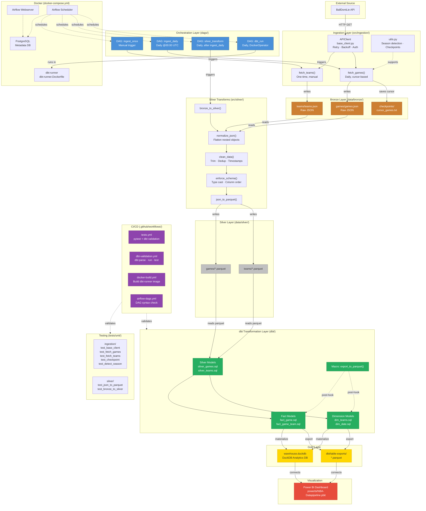

# NBA Data Engineering Pipeline — Architecture

```mermaid
graph TB
    subgraph EXT["External Source"]
        API["BallDontLie API"]
    end

    subgraph INGESTION["Ingestion Layer  (src/ingestion/)"]
        CLIENT["APIClient<br/>base_client.py<br/>Retry · Backoff · Auth"]
        FETCH_TEAMS["fetch_teams()<br/>One-time, manual"]
        FETCH_GAMES["fetch_games()<br/>Daily, cursor-based"]
        UTILS_ING["utils.py<br/>Season detection · Checkpoints"]
    end

    subgraph AIRFLOW["Orchestration Layer  (dags/)"]
        DAG1["DAG: ingest_once<br/>Manual trigger"]
        DAG2["DAG: ingest_daily<br/>Daily @00:00 UTC"]
        DAG3["DAG: silver_transform<br/>Daily, after ingest_daily"]
        DAG4["DAG: dbt_run<br/>Daily, DockerOperator"]
    end

    subgraph BRONZE["Bronze Layer  (data/bronze/)"]
        B_TEAMS["teams/teams.json<br/>Raw JSON"]
        B_GAMES["games/games.json<br/>Raw JSON"]
        CURSOR["checkpoints/<br/>cursor_games.txt"]
    end

    subgraph SILVER_SRC["Silver Transforms  (src/silver/)"]
        NORMALIZE["normalize_json()<br/>Flatten nested objects"]
        CLEAN["clean_data()<br/>Trim · Dedup · Timestamps"]
        ENFORCE["enforce_schema()<br/>Type cast · Column order"]
        CONVERT["json_to_parquet()"]
        PIPELINE["bronze_to_silver()"]
    end

    subgraph SILVER["Silver Layer  (data/silver/)"]
        S_GAMES["games/*.parquet"]
        S_TEAMS["teams/*.parquet"]
    end

    subgraph DBT["dbt Transformation Layer  (dbt/)"]
        direction TB
        DBT_SILVER["Silver Models<br/>silver_games.sql<br/>silver_teams.sql"]
        DBT_FACTS["Fact Models<br/>fact_game.sql<br/>fact_game_team.sql"]
        DBT_DIMS["Dimension Models<br/>dim_teams.sql<br/>dim_date.sql"]
        MACRO["Macro: export_to_parquet()"]
    end

    subgraph GOLD["Gold Layer"]
        DDB["warehouse.duckdb<br/>DuckDB Analytics DB"]
        PARQUET_EXP["dbt/table-exports/<br/>*.parquet"]
    end

    subgraph VIZ["Visualization"]
        PBI["Power BI Dashboard<br/>powerbi/NBA-Datapipeline.pbit"]
    end

    subgraph CICD["CI/CD  (.github/workflows/)"]
        WF1["tests.yml<br/>pytest + dbt validation"]
        WF2["dbt-vailidation.yml<br/>dbt parse · run · test"]
        WF3["docker-build.yml<br/>Build dbt-runner image"]
        WF4["airflow-dags.yml<br/>DAG syntax check"]
    end

    subgraph TESTS["Testing  (tests/unit/)"]
        T_ING["ingestion/<br/>test_base_client<br/>test_fetch_games<br/>test_fetch_teams<br/>test_checkpoint<br/>test_detect_season"]
        T_SIL["silver/<br/>test_json_to_parquet<br/>test_bronze_to_silver"]
    end

    subgraph DOCKER["Docker  (docker-compose.yml)"]
        AF_WEB["Airflow Webserver"]
        AF_SCHED["Airflow Scheduler"]
        PG["PostgreSQL<br/>Metadata DB"]
        DBT_RUNNER["dbt-runner<br/>dbt-runner.Dockerfile"]
    end

    %% Data Flow
    API -->|HTTP GET| CLIENT
    CLIENT --> FETCH_TEAMS
    CLIENT --> FETCH_GAMES
    UTILS_ING -.->|supports| FETCH_GAMES

    DAG1 -->|triggers| FETCH_TEAMS
    DAG2 -->|triggers| FETCH_GAMES

    FETCH_TEAMS -->|writes| B_TEAMS
    FETCH_GAMES -->|writes| B_GAMES
    FETCH_GAMES -->|saves cursor| CURSOR

    DAG3 -->|triggers| PIPELINE
    PIPELINE --> NORMALIZE --> CLEAN --> ENFORCE --> CONVERT

    B_TEAMS -->|reads| NORMALIZE
    B_GAMES -->|reads| NORMALIZE

    CONVERT -->|writes| S_GAMES
    CONVERT -->|writes| S_TEAMS

    DAG4 -->|runs in| DBT_RUNNER

    S_GAMES -->|reads parquet| DBT_SILVER
    S_TEAMS -->|reads parquet| DBT_SILVER

    DBT_SILVER --> DBT_FACTS
    DBT_SILVER --> DBT_DIMS
    MACRO -.->|post-hook| DBT_FACTS
    MACRO -.->|post-hook| DBT_DIMS

    DBT_FACTS -->|materialize| DDB
    DBT_DIMS -->|materialize| DDB
    DBT_FACTS -->|export| PARQUET_EXP
    DBT_DIMS -->|export| PARQUET_EXP

    DDB -->|connects| PBI
    PARQUET_EXP -->|connects| PBI

    %% Docker relationships
    AF_WEB -.-> PG
    AF_SCHED -.-> PG
    AF_SCHED -.->|schedules| DAG1
    AF_SCHED -.->|schedules| DAG2
    AF_SCHED -.->|schedules| DAG3
    AF_SCHED -.->|schedules| DAG4

    %% CI/CD relationships
    CICD -.->|validates| TESTS
    CICD -.->|validates| DBT

    %% Styling
    classDef bronze fill:#cd7f32,color:#fff,stroke:#8B4513
    classDef silver fill:#c0c0c0,color:#333,stroke:#808080
    classDef gold fill:#ffd700,color:#333,stroke:#daa520
    classDef blue fill:#4a90d9,color:#fff,stroke:#2c5f8a
    classDef green fill:#27ae60,color:#fff,stroke:#1e8449
    classDef purple fill:#8e44ad,color:#fff,stroke:#6c3483
    classDef red fill:#e74c3c,color:#fff,stroke:#c0392b

    class B_TEAMS,B_GAMES,CURSOR bronze
    class S_GAMES,S_TEAMS silver
    class DDB,PARQUET_EXP gold
    class DAG1,DAG2,DAG3,DAG4 blue
    class DBT_SILVER,DBT_FACTS,DBT_DIMS,MACRO green
    class WF1,WF2,WF3,WF4 purple
    class PBI red
```
